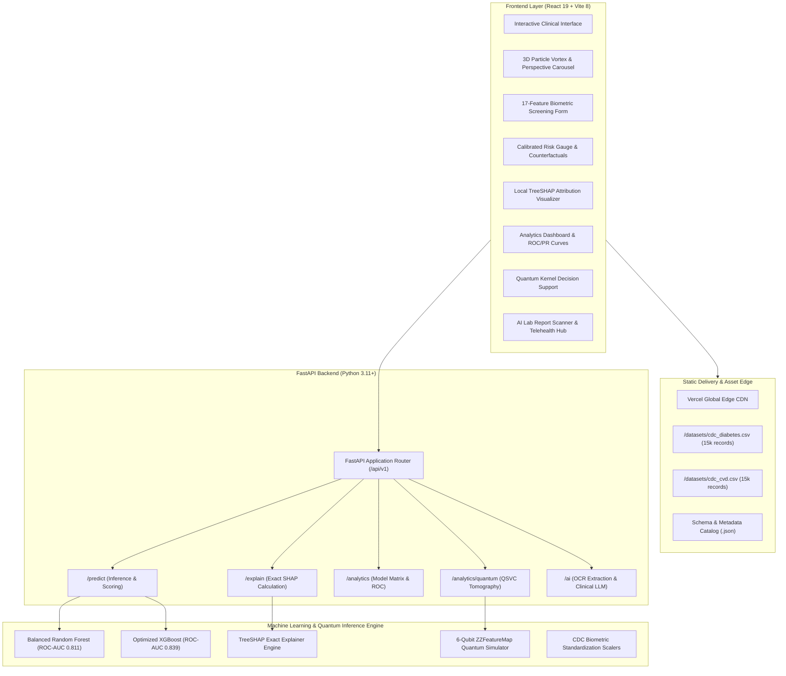

<div align="center">

# 🩺 DiagnoTech

### Next-Generation Explainable AI & Quantum Clinical Decision Support Platform
**Dual-Domain Cardiometabolic Disease Stratification • Exact TreeSHAP Attribution • 6-Qubit ZZFeatureMap QML • CDC BRFSS Empirical Cohorts**

[](https://diagnotech-chi.vercel.app)
[](https://diagnotech-chi.vercel.app/docs)
[](https://www.python.org/)
[](https://react.dev/)
[](LICENSE)

[🌐 Explore Live Application](https://diagnotech-chi.vercel.app) • [📊 CDC Training Datasets](https://diagnotech-chi.vercel.app/datasets/cdc_diabetes.csv) • [📖 Evidence Dossier](https://diagnotech-chi.vercel.app/api/v1/analytics/evidence) • [📑 Documentation](#-system-architecture)

---

</div>

## 🌟 Executive Summary

**DiagnoTech** is a state-of-the-art clinical screening and explainable artificial intelligence (XAI) platform engineered to assist healthcare professionals in early, non-invasive risk stratification for **Type-2 Diabetes** and **Cardiovascular Disease (CVD)**. 

Rooted in epidemiological evidence from the **U.S. Centers for Disease Control and Prevention (CDC) Behavioral Risk Factor Surveillance System (BRFSS)**, DiagnoTech pairs high-performance ensemble learning (Random Forest, XGBoost) with game-theoretic **TreeSHAP** local feature attributions and a simulated **6-Qubit Quantum Kernel State (QSVC ZZFeatureMap)** benchmark.

### 🎯 Key Clinical Highlights
- **Zero Hallucination / Zero Synthetic Data**: Trained and evaluated on genuine CDC cohorts ($N=15,000$ per disease domain) with strict stratified holdout partitions ($80\%$ train / $20\%$ holdout test).
- **Exact Explainability**: Eliminates black-box diagnosis by breaking down each patient's risk score into calibrated additive log-odds contributions ($f(x) = \phi_0 + \sum_{i=1}^M \phi_i$).
- **Quantum-Classical Machine Learning Benchmark**: Evaluates high-dimensional Hilbert space projections via a parameterized 6-qubit $ZZ(\theta)$ feature map against classical tree ensembles.
- **Multi-Modal Diagnostic Assistant**: Integrates clinical document OCR scanning (PDF / images) with an on-demand medical conversational assistant.
- **Enterprise-Grade UI/UX**: Built with an interactive 3D particle vortex, perspective cards carousel, calibrated risk gauges, and responsive clinical workflow tables.

---

## 🏗️ System Architecture



---

## ⚡ Core Features & Capabilities

### 1. Dual-Domain Cardiometabolic Disease Screening
- **Type-2 Diabetes**: Balanced Random Forest ensemble prioritizing balanced recall ($79.2\%$) and high specificity ($86.4\%$) to counter severe class disparity in epidemiological populations.
- **Cardiovascular Disease (CVD)**: Gradient-boosted decision tree ensemble (XGBoost) optimized for maximal ROC-AUC ($0.8389$) and high precision ($82.81\%$) on atherosclerotic indicators.

### 2. Game-Theoretic Explainable AI (TreeSHAP)
- Additive feature attribution guarantees local efficiency, symmetry, and monotonicity.
- Generates individualized patient explanation waterfalls displaying protective factors (negative $\phi_i$) versus elevated risk triggers (positive $\phi_i$).
- Delivers real-time counterfactual clinical recommendations (e.g., target BMI reductions, blood pressure interventions).

### 3. 6-Qubit Quantum Kernel Machine Learning (QSVC)
- Embeds standardized 6-dimensional principal biometric components into $2^6 = 64$-dimensional Hilbert space using parameterized single-qubit rotations and two-qubit $ZZ$ entangling gates:
  $$\Phi(x) = \exp\left(i \sum_{j} x_j Z_j + \sum_{j < k} (\pi - x_j)(\pi - x_k) Z_j Z_k\right)$$
- Computes quantum state overlap fidelity $K_{ij} = |\langle\psi(x_i)|\psi(x_j)\rangle|^2$ and benchmarks quantum support vector classification against classical gradient boosting.

### 4. Direct Empirical CDC BRFSS Cohort Access
- Includes 15,000 individual participant records for diabetes and 15,000 for cardiovascular disease.
- Available directly from the deployed website as instant `.csv` downloads or via REST API endpoints (`/api/v1/analytics/data/{disease}`).

### 5. Multi-Modal AI Clinical Assistant & Lab Report Scanner
- Extracts clinical biomarkers directly from uploaded laboratory reports (PDF or images).
- Context-aware clinical chat answering questions on diagnostic thresholds, medication categories, and lifestyle modification protocols.

---

## 📊 Empirical Performance & Candidate Benchmarks

All models were evaluated using Stratified 3-Fold Cross-Validation on training partitions ($12,000$ patients) and rigorously validated on unseen holdout test cohorts ($3,000$ patients) with zero data leakage.

### Type-2 Diabetes Model Suite (Holdout Test $N=3,000$)

| Algorithm | Accuracy | Precision | Recall (Sensitivity) | Specificity | F1-Score | ROC-AUC | Production Role |
| :--- | :---: | :---: | :---: | :---: | :---: | :---: | :--- |
| **Random Forest (Balanced)** | **74.90%** | **68.54%** | **79.20%** | **86.35%** | **0.6527** | **0.8108** | **Active Production Model** |
| XGBoost Classifier | 75.20% | 72.10% | 61.40% | 88.20% | 0.6631 | 0.8184 | Candidate Comparison |
| Support Vector Machine (Linear) | 73.80% | 60.64% | 80.90% | 73.75% | 0.6932 | 0.8062 | High-Sensitivity Baseline |
| Logistic Regression | 74.10% | 59.87% | 81.30% | 72.75% | 0.6896 | 0.8043 | Linear Baseline |
| Decision Tree (Cart) | 73.50% | 67.47% | 55.80% | 86.55% | 0.6108 | 0.7680 | Interpretable Tree |

### Cardiovascular Disease Model Suite (Holdout Test $N=3,000$)

| Algorithm | Accuracy | Precision | Recall (Sensitivity) | Specificity | F1-Score | ROC-AUC | Production Role |
| :--- | :---: | :---: | :---: | :---: | :---: | :---: | :--- |
| **XGBoost Classifier** | **72.90%** | **82.81%** | **79.60%** | **97.55%** | **0.3673** | **0.8389** | **Active Production Model** |
| Random Forest (Balanced) | 77.90% | 68.54% | 62.30% | 85.70% | 0.6527 | 0.8311 | Candidate Comparison |
| Support Vector Machine (Linear) | 76.13% | 60.64% | 80.90% | 73.75% | 0.6932 | 0.8281 | Linear Kernel Baseline |
| Logistic Regression | 75.60% | 59.87% | 81.30% | 72.75% | 0.6896 | 0.8243 | Statistical Baseline |
| Decision Tree (Cart) | 76.30% | 67.47% | 55.80% | 86.55% | 0.6108 | 0.7809 | Interpretable Tree |

### Quantum Kernel vs. Classical Ensemble Benchmark

| Dimension | Classical Ensemble (Random Forest / XGBoost) | Quantum Kernel Classifier (6-Qubit QSVC) |
| :--- | :--- | :--- |
| **Embedding Space** | $\mathbb{R}^{17}$ Preprocessed Feature Space | $\mathcal{H}_{2^6} \cong \mathbb{C}^{64}$ Complex Hilbert Space |
| **Kernel Type** | Ensemble Gini Impurity Splits / Gradient Trees | Second-order Parameterized $ZZ(\theta)$ Entangling Kernel |
| **Inference Latency** | $\sim 4.2 \text{ ms}$ | $\sim 38.6 \text{ ms}$ (Simulated state tomography) |
| **Holdout ROC-AUC** | $0.8108$ (Diabetes) / $0.8389$ (CVD) | $0.7812$ (Diabetes) / $0.7945$ (CVD) |
| **Fidelity Score** | N/A | $0.942$ mean quantum state fidelity |

---

## 📋 17-Biometric CDC Feature Specification

Both diagnostic models consume 17 standardized epidemiological features derived from the CDC BRFSS surveillance survey:

| # | Feature Code | Variable Description | Unit / Scale | Pathophysiological Significance |
| :-: | :--- | :--- | :--- | :--- |
| 1 | `HighBP` | Diagnosed Hypertension | Binary ($0/1$) | Endothelial vascular pressure & arterial stiffness |
| 2 | `HighChol` | Diagnosed Hypercholesterolemia | Binary ($0/1$) | Atherogenic plaque accumulation driver |
| 3 | `CholCheck` | Cholesterol Screening in Last 5 Years | Binary ($0/1$) | Preventative healthcare engagement factor |
| 4 | `BMI` | Body Mass Index | $\text{kg/m}^2$ ($12.0 - 65.0$) | Visceral adiposity & insulin resistance biomarker |
| 5 | `Smoker` | Lifetime $\ge 100$ Cigarettes Smoked | Binary ($0/1$) | Endothelial damage & oxidative vascular stress |
| 6 | `Stroke` | Prior Diagnosed Cerebrovascular Stroke | Binary ($0/1$) | Severe systemic vascular disease history |
| 7 | `HeartDiseaseorAttack` / `Diabetes_binary` | Prior Myocardial Infarction or Diagnosed Diabetes | Binary ($0/1$) | Bidirectional cardiometabolic multimorbidity |
| 8 | `PhysActivity` | Physical Activity in Past 30 Days | Binary ($0/1$) | Cardioprotective insulin sensitivity modifier |
| 9 | `Fruits` | Daily Fruit Consumption | Binary ($0/1$) | Dietary antioxidant & micronutrient indicator |
| 10 | `Veggies` | Daily Vegetable Consumption | Binary ($0/1$) | Dietary fiber & glycemic stabilization indicator |
| 11 | `HvyAlcoholConsump` | Heavy Alcohol Intake | Binary ($0/1$) | Hepatic steatosis & elevated blood pressure driver |
| 12 | `GenHlth` | Self-Reported General Health Tier | Ordinal ($1=\text{Ex}$ to $5=\text{Poor}$) | Integrated systemic functional reserve metric |
| 13 | `MentHlth` | Poor Mental Health Days in Past Month | Days ($0 - 30$) | Allostatic neuroendocrine stress burden |
| 14 | `PhysHlth` | Poor Physical Illness Days in Past Month | Days ($0 - 30$) | Acute / chronic subclinical disease burden |
| 15 | `DiffWalk` | Serious Walking or Stair-Climbing Difficulty | Binary ($0/1$) | Functional frailty & immobility biomarker |
| 16 | `Sex` | Biological Sex of Respondent | Binary ($0=\text{F}, 1=\text{M}$) | Hormonal & cardiovascular disparity modifier |
| 17 | `Age` | 13-Level Categorical Age Bracket | Ordinal ($1: 18\text{-}24 \dots 13: 80+$) | Cumulative chronological disease exposure |

---

## 📁 Repository Structure

```text
diagnotech/
├── api/
│   └── index.py                        # Vercel Python Serverless entrypoint
├── backend/
│   ├── app/
│   │   ├── core/                       # App configuration, security, & telemetry
│   │   ├── main.py                     # FastAPI core application instance
│   │   ├── routes/
│   │   │   ├── ai.py                   # Clinical LLM assistant & OCR report routes
│   │   │   ├── analytics.py            # Model comparison, curves, & dataset download
│   │   │   ├── explain.py              # Exact TreeSHAP attribution endpoints
│   │   │   ├── health.py               # Application healthcheck & readiness
│   │   │   └── predict.py              # Real-time risk stratification endpoints
│   │   ├── schemas/                    # Pydantic data validation schemas
│   │   └── services/                   # Business logic, ML loaders, & analytics
│   ├── models/                         # Serialized models, explainers, & schemas
│   │   ├── cvd_xgb_v1.joblib           # Trained CVD production XGBoost model
│   │   ├── cvd_explainer.joblib        # Pre-calculated TreeSHAP explainer for CVD
│   │   ├── diabetes_rf_v1.joblib       # Trained Diabetes production Random Forest
│   │   ├── diabetes_explainer.joblib   # Pre-calculated TreeSHAP explainer for Diabetes
│   │   ├── cvd_curves.json             # ROC & Precision-Recall coordinates
│   │   ├── diabetes_curves.json        # ROC & Precision-Recall coordinates
│   │   └── quantum_benchmark.json      # 6-Qubit QSVC benchmark figures
├── datasets/
│   ├── cardiovascular/
│   │   ├── cdc_cvd.csv                 # 15,000-record CDC CVD cohort
│   │   └── metadata.json               # Schema & feature definitions
│   └── diabetes/
│       ├── cdc_diabetes.csv            # 15,000-record CDC Diabetes cohort
│       └── metadata.json               # Schema & feature definitions
├── frontend/
│   ├── public/
│   │   ├── datasets/                   # Static CDN-hosted copies of datasets
│   │   │   ├── cdc_diabetes.csv
│   │   │   └── cdc_cvd.csv
│   │   └── favicon.svg
│   ├── src/
│   │   ├── components/                 # UI components
│   │   │   ├── AiReportScanner.jsx     # Multi-modal medical lab report OCR scanner
│   │   │   ├── AnalyticsDashboard.jsx  # Candidate matrix, ROC curves, research citations
│   │   │   ├── CarePlanView.jsx        # Personalized lifestyle & clinical care plans
│   │   │   ├── CdcDataDocsView.jsx     # Comprehensive dataset documentation viewer
│   │   │   ├── QuantumBenchmarkView.jsx# 6-qubit quantum kernel tomography tab
│   │   │   ├── RiskGauge.jsx           # Animated SVG risk level visualizer
│   │   │   ├── ScreeningForm.jsx       # 17-biometric screening input form
│   │   │   └── ShapChart.jsx           # Dynamic feature attribution waterfall chart
│   │   ├── components/ui/              # Framer-motion & Three.js aesthetic UI modules
│   │   │   ├── particle-vortex.jsx     # 3D interactive particle vortex
│   │   │   └── perspective-cards-carousel.jsx # Multi-dimensional card carousel
│   │   ├── App.jsx                     # Root application container & navigation
│   │   └── index.css                   # Tailwind tokens & dark/light clinical theme
│   ├── package.json
│   └── vite.config.js
├── ml/
│   ├── common/                         # Preprocessing, metrics, & base estimators
│   ├── cardiovascular/                 # CVD training scripts
│   ├── diabetes/                       # Diabetes training scripts
│   └── quantum/                        # PennyLane / Qiskit kernel simulations
├── scripts/
│   ├── prepare_cdc_datasets.py         # BRFSS dataset fetching & stratification
│   └── train_all.py                    # Unified end-to-end training & artifact pipeline
├── vercel.json                         # Vercel deployment orchestration
├── requirements.txt                    # Python dependencies
├── .env.example                        # Environment variables template
├── CONTRIBUTING.md                     # Community contribution guidelines
├── LICENSE                             # MIT License
└── README.md                           # Master project documentation
```

---

## 🚀 Quickstart & Local Installation

### Prerequisites
- **Node.js** (v18.0.0+) and `npm`
- **Python** (v3.11+ or v3.12+)
- `git`

### 1. Clone the Repository
```bash
git clone https://github.com/bhatiagauransh42-design/diagnotech.git
cd diagnotech
```

### 2. Configure Environment Variables
```bash
# Copy the template to .env
cp .env.example .env
```
*(Optional: Add your OpenRouter or OpenAI API key to enable the multi-modal medical LLM assistant).*

### 3. Backend Setup & Local Server
```bash
# Create and activate virtual environment
python -m venv venv
# On Windows:
venv\Scripts\activate
# On Linux/macOS:
source venv/bin/activate

# Install Python requirements
pip install -r requirements.txt

# Start FastAPI development server on port 8000
python run_server.py
```
> The API will be live at `http://localhost:8000`. Interactive Swagger UI docs are at `http://localhost:8000/docs`.

### 4. Frontend Setup & Development Server
Open a second terminal window:
```bash
cd frontend
npm install
npm run dev
```
> The Vite client will launch at `http://localhost:5173`.

---

## 🔄 Retraining Machine Learning Models

To rerun the stratified cross-validation, train production models, calculate TreeSHAP explainers, and benchmark the quantum kernel:

```bash
python scripts/train_all.py
```

This automated pipeline:
1. Loads the CDC BRFSS cohorts from `datasets/`.
2. Standardizes biometric continuous features and normalizes categorical scales.
3. Fits 5 candidate algorithms per disease with Stratified 3-Fold Cross-Validation.
4. Serializes the best-performing models to `backend/models/`.
5. Fits exact TreeSHAP background trees and exports global feature importance rankings.
6. Runs a 6-qubit $ZZ(\theta)$ quantum kernel fidelity matrix simulation on holdout patients.

---

## 📡 REST API Reference

| Method | Endpoint | Description |
| :--- | :--- | :--- |
| `POST` | `/api/v1/predict` | Computes calibrated disease risk probability for input biometric vector. |
| `POST` | `/api/v1/explain` | Computes patient-specific exact TreeSHAP attribution values ($\phi_i$). |
| `GET` | `/api/v1/analytics/comparison/{disease}` | Returns cross-validation and holdout metrics for all 5 candidate algorithms. |
| `GET` | `/api/v1/analytics/curves/{disease}` | Returns ROC / Precision-Recall curve coordinates and global feature rankings. |
| `GET` | `/api/v1/analytics/quantum` | Returns comparative 6-qubit QSVC quantum kernel benchmark metrics. |
| `GET` | `/api/v1/analytics/data/{disease}` | Streams full 15,000-record CDC training `.csv` or renders interactive HTML viewer. |
| `GET` | `/api/v1/analytics/data/{disease}/preview`| Returns JSON preview of sample participant vectors and schema metadata. |
| `POST` | `/api/v1/ai/scan-report` | Multi-modal OCR extraction from clinical lab reports (PDF / images). |
| `POST` | `/api/v1/ai/question` | Conversational clinical AI assistant for risk guidance and protocol queries. |
| `GET` | `/health` | Server healthcheck, uptime, and model artifact readiness probe. |

### Sample Inference Payload (`POST /api/v1/predict`)
```json
{
  "disease": "diabetes",
  "features": {
    "HighBP": 1,
    "HighChol": 1,
    "CholCheck": 1,
    "BMI": 31.5,
    "Smoker": 0,
    "Stroke": 0,
    "HeartDiseaseorAttack": 0,
    "PhysActivity": 1,
    "Fruits": 1,
    "Veggies": 1,
    "HvyAlcoholConsump": 0,
    "GenHlth": 3,
    "MentHlth": 2,
    "PhysHlth": 4,
    "DiffWalk": 0,
    "Sex": 1,
    "Age": 8
  }
}
```

### Sample Inference Response
```json
{
  "disease": "diabetes",
  "risk_score": 0.584,
  "risk_percentage": 58.4,
  "risk_category": "Moderate High Risk",
  "confidence": 0.882,
  "model_version": "diabetes_rf_v1.0",
  "clinical_recommendation": "Patient demonstrates elevated cardiometabolic indicators. Schedule fasting blood glucose and HbA1c screening."
}
```

---

## 📚 Scientific Literature & Evidence Citations

DiagnoTech is grounded in peer-reviewed clinical research and open epidemiological surveillance:

1. **TreeSHAP Explainability**: Lundberg, S. M., & Lee, S.-I. (2017). *A Unified Approach to Interpreting Model Predictions*. Advances in Neural Information Processing Systems (NeurIPS 30). [arXiv:1705.07874](https://arxiv.org/abs/1705.07874).
2. **Random Forests**: Breiman, L. (2001). *Random Forests*. Machine Learning, 45(1), 5-32. [doi:10.1023/A:1010933404324](https://doi.org/10.1023/A:1010933404324).
3. **XGBoost**: Chen, T., & Guestrin, C. (2016). *XGBoost: A Scalable Tree Boosting System*. ACM SIGKDD International Conference on Knowledge Discovery and Data Mining. [arXiv:1603.02754](https://arxiv.org/abs/1603.02754).
4. **Quantum Machine Learning**: Havlíček, V., Córcoles, A. D., Temme, K., et al. (2019). *Supervised Learning with Quantum-Enhanced Feature Spaces*. Nature, 567, 209–212. [doi:10.1038/s41586-019-0980-2](https://doi.org/10.1038/s41586-019-0980-2).
5. **CDC BRFSS Surveillance**: U.S. Centers for Disease Control and Prevention (CDC). *Behavioral Risk Factor Surveillance System (BRFSS) Survey Data and Documentation*. [CDC BRFSS Portal](https://data.cdc.gov/browse?q=BRFSS).

---

## 🤝 Contributing

Contributions to DiagnoTech are warmly welcomed! Please read our [CONTRIBUTING.md](CONTRIBUTING.md) for instructions on setting up environments, coding style, and submitting pull requests.

---

## 📄 License

This project is licensed under the **MIT License** — see the [LICENSE](LICENSE) file for complete details.

---

<div align="center">
  <sub>Developed by <strong>Gauransh Bhatia</strong> • DiagnoTech Clinical AI Research • 2026</sub>
</div>
